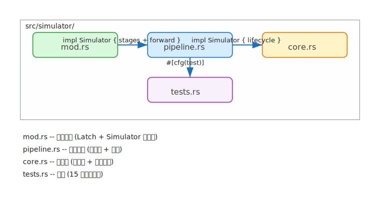
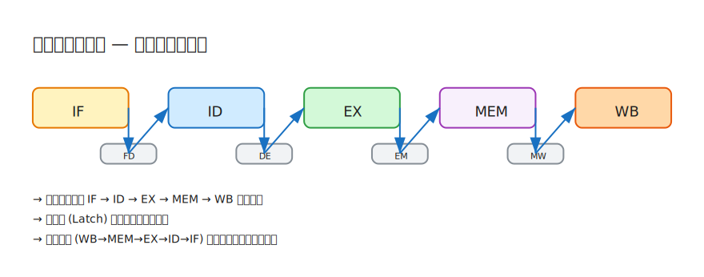
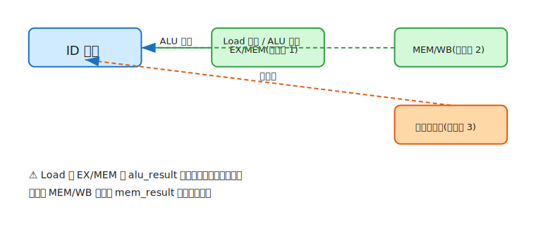
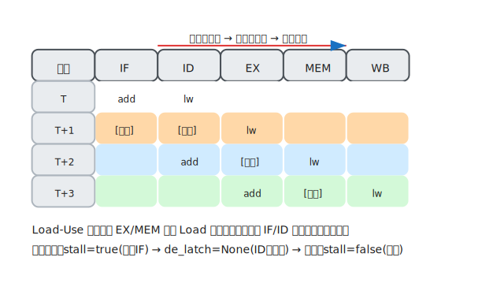

# 重构：从单文件到模块化设计

## 为什么要做这次重构

上一篇文档完成时，`simulator.rs` 已经膨胀到 642 行。Latch 定义、Simulator 状态、五级流水线逻辑、转发网络、统计输出，再加上 15 个测试用例——全都挤在一个文件里。虽然对于几百行的规模来说不能算灾难，但已经有了清晰的功能边界，强行压缩在同一个文件中已经偏离了"结构反映设计意图"的原则。

这次重构的核心动机不是"文件太长了要切一切"，而是**让代码组织方式直接反映我们对流水线硬件的认知模型**。

## 设计原理一：流水线是状态机

如果我们把流水线理解为一台状态机，那么这台机器的定义可以用一句话说清楚：

> 在每一个时钟周期，五个阶段按照逆向顺序（WB → MEM → EX → ID → IF）各自执行一次状态转移——将数据从上一级锁存器取出、处理、写入下一级锁存器。

这意味着代码结构天然要回答三个问题：

1. **状态是什么？** —— 锁存器和寄存器文件
2. **转移规则是什么？** —— 每个阶段在做什么
3. **如何编排？** —— 周期级别的主循环

这三个问题对应了我们拆分后的三个核心文件：

| 问题 | 对应模块 | 内容 |
|------|---------|------|
| 状态是什么 | `mod.rs` | Latch、Simulator 结构体 |
| 转移规则 | `pipeline.rs` | 五个阶段方法 + 转发网络 |
| 如何编排 | `core.rs` | `step_cycle()` 主循环 + 生命周期 |

这不是按照"代码行数差不多"来机械切割，而是**按照流水线硬件的实际结构来组织**。



## 设计原理二：锁存器是阶段间的唯一接口

在硬件中，流水线阶段的输入和输出只通过流水线寄存器来交互——IF 的输出进入 IF/ID 寄存器，ID 读取 IF/ID 寄存器，输出到 ID/EX 寄存器，以此类推。

对应到代码中，`Latch` 就是这个寄存器。它的设计遵循一个关键约束：

> 所有通过流水线的数据，要么来自 Trace（静态事实），要么在某个阶段产生后写入锁存器。

具体来说，Latch 中的字段分为两类：

- **静态携带**：`record`（TraceRecord）——从 IF 阶段一路携带到 WB 阶段，只读不写
- **动态计算**：`rs1_val`、`rs2_val`、`alu_result`、`mem_result`——在 ID、EX、MEM 阶段依次填充

这种设计的妙处在于：**每个阶段只关心自己需要修改的字段**，不需要知道其他阶段在做什么。EX 阶段写入 `alu_result`，MEM 阶段写入 `mem_result`，WB 阶段根据指令类型决定取哪个值写回。各个阶段之间的耦合仅限于"我读到的必然是上一阶段写出的"这一时序约定。



## 设计原理三：逆向执行顺序

`step_cycle()` 中阶段执行顺序是 **WB → MEM → EX → ID → IF**，而非直觉上的 IF → ID → EX → MEM → WB。

这不是实现偏好，而是**转发能否在同一周期内生效的关键**。

考虑一个场景：指令 A 在本周期的 MEM 阶段取回 Load 数据，指令 B 在本周期的 ID 阶段需要读取同一个寄存器。

- 如果 ID 先于 MEM 执行：B 在 ID 阶段读到的还是旧值（MEM 阶段还没来得及把 `mem_result` 写入 MEM/WB 锁存器）
- 如果 MEM 先于 ID 执行：MEM 阶段先将 `mem_result` 写入 MW 锁存器，ID 阶段随后调用 `forward()` 时就能直接从 MW 锁存器中取到最新值

换句话说：**逆向执行让"先产生结果，再使用结果"能在同一个周期内完成**。这实际上模拟了硬件中组合逻辑的并行传播——在硬件里，寄存器写入和读取发生在同一个时钟沿的两侧，不存在执行顺序问题。但在软件模拟器中，我们必须通过反序调用函数来模拟这种"写优先于读"的效果。

## 设计原理四：转发网络的优先级

转发网络的设计不只是一个查表逻辑，它遵循的是**时序最近原则**：

```
EX/MEM > MEM/WB > 寄存器文件
```

为什么这个优先级是正确的？因为在一个顺序流水线中，没有任何指令能比 EX/MEM 中的那条指令更晚地产生结果——它刚刚在上一周期完成 EX 计算，结果在本周期立即可用。MEM/WB 是再上一周期的结果，寄存器文件则是最早一批已提交的结果。

这里有两条推论的边界情况：

1. **Load 不能从 EX/MEM 转发**：因为 Load 的 `alu_result` 在 EX 阶段存放的是访存地址，真正的数据要等 MEM 阶段结束才能就绪。转发网络必须区分"这个字段里有值"和"这个字段里有**正确的**值"——两者不是一回事。

2. **MEM/WB 的 Load 走 `mem_result` 而非常 `alu_result`**：同理，Load 在 MEM/WB 时，数据在 `mem_result` 而非 `alu_result`。转发如果选错了字段，就会把地址当作数据传出去。

这背后的通用原则是：**转发网络不仅要知道"谁写了 rd"，还要知道"这个结果在哪个字段里是有效的"**。这是转发与简单的寄存器重命名之间最本质的区别。



## 设计原理五：Load-Use 是唯一真正需要停顿的冒险

在经典五级流水线中，理论上存在 RAW、WAR、WAW 三种数据冒险。但在这个模拟器中，**只有 RAW 的一个子类——Load-Use——需要停顿**。

为什么 WAR 和 WAW 不需要处理？

- **WAW 不存在**：这是一个顺序发射、顺序写回的流水线。两条写同一寄存器的指令按程序顺序进入流水线，必然按程序顺序写回——不会有倒序覆盖。
- **WAR 不存在**：同样是顺序流水的直接推论。读寄存器一定发生在对应的写之前（以程序序为准），不会出现"后一条指令先写了，前一条指令却读了新值"。

那 RAW 中为什么只有 Load-Use 特殊？因为**所有非访存的 ALU 指令在 EX 阶段就已经有结果了**，可以通过 EX/MEM 转发直接传给下一周期的 ID 阶段，数据到达的时间窗口刚好覆盖消费者需要的时刻。Load 的数据要到 MEM 阶段末尾才就绪，比 EX 晚了一个周期——这一周期的时间差就是必须插入一个停顿的根本原因。

停顿机制的三个动作正好对应硬件中的三条控制路径：

| 动作 | 硬件对应 | 效果 |
|------|---------|------|
| `stall = true` | 冻结 PC 寄存器 | IF 不取新指令 |
| `de_latch = None` | 向 ID/EX 寄存器写入 NOP | ID 阶段气泡 |
| 下周期 `stall = false` | 解除冻结 | 之前阻塞的指令继续流动 |



## 设计原理六：模块边界基于耦合度

回到重构本身——为什么 `stage_id` 和 `forward` 在同一个文件中，而不是各自独立？因为它们的耦合太紧密了：

- `stage_id` 是 `forward` 的唯一调用者
- 二者共享对 `em_latch` 和 `mw_latch` 的访问模式
- 二者共同实现了译码阶段的核心职责：确定操作数的来源

如果把它们拆到两个文件，阅读者就需要在两个模块间来回跳转才能理解一条指令的操作数是怎样获取的——这违背了"把相关的东西放在一起"的局部性原理。

反过来，`core.rs` 中的 `step_cycle` 虽然是调用各阶段的编排器，但它不需要知道每个阶段的具体实现——它只负责声明"先做 WB，再做 MEM，再做 EX……"这个执行契约。这是与阶段实现完全解耦的、更高层次的关注点。

## 重构后的结构一览

```
src/simulator/
  ├── mod.rs       -- 状态定义：Latch（流水线寄存器）、Simulator 结构体
  ├── pipeline.rs  -- 转移规则：五个阶段 + 转发网络
  ├── core.rs      -- 编排层：主循环 + 生命周期管理
  └── tests.rs     -- 验证：15 个测试用例
```

每个文件的职责是一个词就能概括的：**状态**、**规则**、**编排**、**验证**。

这就是这次重构的核心思想：不是把大文件拆小，而是让代码的模块边界与我们对流水线硬件的认知边界对齐。
